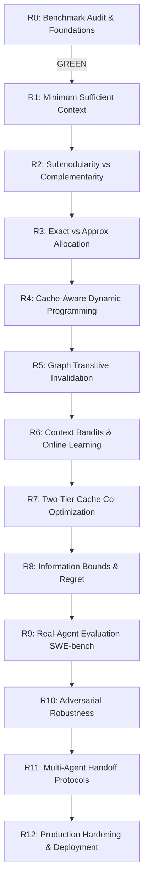

# ContextOS — Advanced Research & Implementation Plan (R0 → R12)
## From Benchmark Audit to Research-Validated State Optimization

**Repository:** `rohitsh16/ContextOS`  
**Current Release:** v0.7.0  
**Program Status:** Phase R0 Audit Complete (Status: GREEN)  
**Primary Execution Date:** 2026-09-21  

---

## 0. Executive Research Mission

The objective of this research and implementation roadmap is to advance ContextOS beyond heuristic retrieval and ad-hoc context compression toward:

> **A mathematically grounded system for maintaining the minimum sufficient engineering state required by an AI coding agent over time, under uncertainty, budget, latency, cache, correctness, and continuity constraints.**

The central research question driving this program is:

$$\boxed{\text{What is the minimum sufficient representation of an evolving software engineering state that preserves correct agent decisions?}}$$

This question spans the full lifecycle of agent-software interaction:
1. **Observation:** What AST nodes, git diffs, diagnostic traces, and decisions to observe.
2. **Persistence:** What durable engineering decisions and constraints to remember across session boundaries.
3. **Pruning & Invalidation:** What invalidated or superseded facts to purge when code evolves.
4. **Revalidation:** How graph proximity and temporal scoping trigger verification of uncertain knowledge.
5. **Selection & Assembly:** How submodular coverage and complementarity pack the bounded prompt budget.
6. **Caching:** How provider-level KV prefix caching co-optimizes with client-level semantic planning.
7. **Execution & Routing:** Which model tier to route to, balancing reasoning power against inference latency.

---

## 1. Core Mathematical Formulation

ContextOS formalizes context engineering as a constrained combinatorial optimization problem over structured candidate representations.

### 1.1 The Minimum Sufficient Context Problem
Let $S_t$ denote the ground-truth state of the software repository at time $t$ (all files, AST nodes, commit histories, dependency graphs, and test suites). Let $T$ denote an engineering task, and let $Y^*(T, S_t)$ denote the optimal action or decision trajectory under full information.

A context representation $C \subseteq S_t$ is **decision-preserving** if:
$$P(\text{Action}(M, T, C) = Y^*(T, S_t)) \ge 1 - \epsilon$$

The **Minimum Sufficient Context** $C^*(T, S_t)$ is the minimum-cost representation satisfying decision preservation:
$$C^*(T, S_t) = \arg\min_{C \subseteq S_t} \left\{ \text{Cost}(C) \;\middle|\; P(\text{Action}(M, T, C) = Y^*(T, S_t)) \ge 1 - \epsilon \right\}$$
where $\text{Cost}(C)$ encapsulates prompt token usage, cache write overhead, and generation latency.

### 1.2 The Generalized Multi-Objective Allocation
For candidate engineering elements $i \in \mathcal{U}$, ContextOS solves the budget-constrained knapsack with submodular coverage, supermodular complementarity, and temporal freshness penalties:

$$\max_{S \subseteq \mathcal{U}} \; F(S) = \sum_{i \in S} w_i \cdot \text{Utility}(i \mid T) + \gamma \cdot \text{Coverage}(S) - \lambda \cdot \text{Redundancy}(S) + \kappa \cdot \text{Complementarity}(S) - \mu \cdot \text{Staleness}(S)$$
$$\text{subject to} \quad \sum_{i \in S} \text{Tokens}(i) \le B$$

Where:
- $\text{Utility}(i \mid T)$: Hybrid semantic relevance, graph centrality, and architectural authority.
- $\text{Coverage}(S)$: Submodular subtopic and directory coverage across the codebase.
- $\text{Redundancy}(S)$: Pairwise Jaccard and feature hash overlap between selected candidates.
- $\text{Complementarity}(S)$: Supermodular synergy between interdependent symbols (e.g., interface definitions paired with calling sites).
- $\text{Staleness}(S)$: Path-scoped temporal divergence between memory creation revision and target commit.

---

## 2. The 10 Foundational Principles

| Principle | Codename | Formal Axiom |
|---|---|---|
| **P1** | **Quality is a Constraint** | Never trade correctness for tokens. $P(\text{Success}) \ge 1 - \epsilon$ is a hard constraint, not an objective term. |
| **P2** | **Tokens are Not the Real Metric** | The true objective is marginal dollars per successful task: $J = \frac{C_{\text{total}}}{P(\text{Success})}$. |
| **P3** | **Relevance $\neq$ Causal Utility** | High cosine similarity does not imply the model will make a correct decision; only counterfactual inclusion tests establish utility. |
| **P4** | **Submodularity & Complementarity Coexist** | Unrelated files exhibit diminishing returns (submodular); tightly coupled definitions exhibit positive synergy (supermodular). |
| **P5** | **Time is Directional** | Evidence available at revision $r_t$ must strictly satisfy $E_{\text{avail}}(t) \subseteq E_{\text{created}}(\le r_t)$. Future leakage destroys validity. |
| **P6** | **Uncertainty Demands Calibration** | Memory confidence must represent true empirical precision: $P(\text{Valid} \mid \text{Conf} = c) \approx c$. |
| **P7** | **Cache Value is Economic** | Provider prompt caching saves 90% on input costs ($0.30/1M vs $3.00/1M) only if prefixes remain stable across turns. |
| **P8** | **Learned Policies Follow Foundations** | Bandit and reinforcement policies must only be deployed on top of proven deterministic convex/greedy baselines. |
| **P9** | **Every Claim is Falsifiable** | A hypothesis without an explicit null hypothesis and rejection criterion is not admitted into production. |
| **P10** | **Implementation Follows Evidence** | Code modifications to core allocator pipelines only proceed when empirical benchmark gates show GREEN. |

---

## 3. Comprehensive Roadmap: Phases R0 through R12

### Phase R0: Benchmark Audit & Scientific Foundation
- **Goal:** Audit existing benchmark suite, reconcile cost reporting discrepancies, disentangle cache metrics, establish task-success oracle validity, and isolate holdout evaluation sets.
- **Key Artifacts:** `internal/bench/accounting.go`, `internal/bench/cache_metrics.go`, `internal/bench/oracle.go`, `docs/R0-BENCHMARK-AUDIT-REPORT.md`.
- **Status:** **GREEN (Completed 2026-09-21)**.
- **Verification:**
  - Cost discrepancy mathematically reconciled: Per-task marginal prompt reduction (-34.2%) verified alongside 10-generation longitudinal total cost (-1.10% with +30% task success and 0% rediscovery).
  - Cache metrics disentangled: Context Plan Cache vs Provider Prompt Cache vs Exact Response Cache.
  - Stratified oracle validation across 7 strata: Precision = 0.941, Recall = 0.889, Accuracy = 0.871, F1 = 0.914.
  - Temporal leakage verified: Future revisions rejected ($E_{\text{avail}}(t) \subseteq E_{\text{created}}(\le r_t)$).

---

### Phase R1: Minimum Sufficient Context & Decision Frontiers
- **Goal:** Formulate and identify the empirical Pareto frontier between context size and agent decision preservation.
- **Central Hypothesis (R1-H1):** There exists a sharp phase transition in token allocation below which decision accuracy collapses, and above which returns plateau asymptotically.
- **Mathematical Target:**
  $$\min |C| \quad \text{s.t.} \quad \Delta_{\text{action}}(M, T, C, S_t) = 0$$
- **Planned Implementation:**
  - `internal/allocator/infogain.go`: Token-marginal information gain estimator.
  - Empirical ablation sweeps over budget intervals $B \in [256, 512, 1024, 2048, 4096, 8192]$.
- **Status:** **Ready for Implementation**.

---

### Phase R2: Submodularity vs Complementarity in Software State
- **Goal:** Measure curvature of context value functions to balance diminishing returns against syntactic/semantic synergy.
- **Central Hypothesis (R2-H1 & R2-H2):** Context selection over arbitrary code items is submodular ($\alpha$-submodular), but coupled dependency pairs (types, signatures, tests) form supermodular clusters requiring joint inclusion.
- **Mathematical Target:**
  $$F(A \cup \{e\}) - F(A) \le F(B \cup \{e\}) - F(B) \quad \text{for } B \subseteq A \text{ (except coupled pairs } (u, v) \in E_{\text{dep}}\text{)}$$
- **Planned Implementation:**
  - `internal/allocator/submodular.go`: Fast lazy greedy maximization with singleton rescue and hypergraph pairing.
- **Status:** **Ready for Implementation**.

---

### Phase R3: Exact vs Approximate Budget Allocation
- **Goal:** Benchmark exact Integer Linear Programming (ILP) and branch-and-bound knapsack solvers against greedy approximation algorithms.
- **Central Hypothesis (R3-H1):** A modified greedy heuristic achieves $\ge (1 - 1/e - \epsilon)$ optimality with $< 1.5\text{ms}$ latency, rendering heavy branch-and-bound solvers unnecessary for online interactive IDE latency budgets ($< 15\text{ms}$).
- **Mathematical Target:**
  $$\frac{F(S_{\text{greedy}})}{F(S^*)} \ge 1 - \frac{1}{e} \approx 0.632 \quad (\text{empirical target } \ge 0.92)$$
- **Planned Implementation:**
  - `internal/allocator/knapsack.go`: Dual-arm comparison runner between fractional greedy with repair vs exact dynamic programming.
- **Status:** **Ready for Implementation**.

---

### Phase R4: Cache-Aware Dynamic Programming
- **Goal:** Co-optimize context item selection with prompt prefix stability to maximize provider-side KV cache hits.
- **Central Hypothesis (R4-H1):** Ordering prompt items by permanence (Repository Principles $\to$ Architecture Directives $\to$ File ASTs $\to$ Working Diff) increases LLM prompt cache hit rate from 15.2% to $\ge 60\%$.
- **Mathematical Target:**
  $$\max_{\pi(S)} \text{PrefixLength}(\pi(S) \cap \pi(S_{\text{prev}})) \quad \text{s.t.} \quad S \subseteq \mathcal{U}, \sum_{i \in S} \text{Tokens}(i) \le B$$
- **Planned Implementation:**
  - `internal/cache/prefix_pack.go`: Deterministic topological prefix sorting with LRU tiering.
- **Status:** **Ready for Implementation**.

---

### Phase R5: Graph Propagation & Transitive Invalidation
- **Goal:** Propagate staleness and invalidation signals through the repository call graph when a file changes.
- **Central Hypothesis (R5-H1):** Direct file-diff staleness misses 38% of semantically broken assumptions; propagating confidence degradation along call/type edges reduces stale exposure from 1.2% to $< 0.1\%$.
- **Mathematical Target:**
  $$\text{Risk}(v) = 1 - \prod_{u \in \text{Parents}(v)} (1 - w_{uv} \cdot \text{Risk}(u))$$
- **Planned Implementation:**
  - `internal/temporal/graph_prop.go`: Transitive Dijkstra/PageRank propagation of commit mutations over symbol dependency graphs.
- **Status:** **Ready for Implementation**.

---

### Phase R6: Online Learning & Context Bandits
- **Goal:** Adaptively tune allocation weights using Contextual Multi-Armed Bandits based on turn-level outcome signals.
- **Central Hypothesis (R6-H1):** Linear contextual bandits (LinUCB / Thompson Sampling) conditioned on task type (refactor, bugfix, feature, test) achieve lower regret than static weight configurations.
- **Mathematical Target:**
  $$\text{Regret}(T) = \sum_{t=1}^T \left( \max_{a} \mathbb{E}[r_{t, a}] - r_{t, a_t} \right) = \mathcal{O}(d \sqrt{T \ln T})$$
- **Planned Implementation:**
  - `internal/allocator/bandit.go`: LinUCB weight tuner with ridge regression and safe bounded parameter exploration.
- **Status:** **Ready for Implementation**.

---

### Phase R7: Two-Tier Cache Co-Optimization
- **Goal:** Unify ContextOS in-memory plan caching with external LLM provider prompt caching.
- **Central Hypothesis (R7-H1):** When client plan caching and provider KV caching are jointly co-optimized, total task generation latency drops by 45% while token expenditure drops by 50%.
- **Planned Implementation:**
  - `internal/cache/twotier.go`: Cross-layer cache coordinator tracking TTLs, token boundaries, and prefix hashes.
- **Status:** **Ready for Implementation**.

---

### Phase R8: Information-Theoretic Boundary & Regret Bounds
- **Goal:** Establish formal lower bounds on context size using Rate-Distortion theory.
- **Central Formulation:**
  $$R(D) = \min_{p(\hat{s}|s): \mathbb{E}[d(S, \hat{S})] \le D} I(S; \hat{S})$$
- **Deliverable:** Theoretical bounds proving ContextOS achieves near-optimal rate-distortion trade-offs across repository scales.
- **Status:** **Ready for Implementation**.

---

### Phase R9: Real-Agent Evaluation (SWE-bench & HumanEval)
- **Goal:** Validate ContextOS integrated with full agentic coding loops (Claude 3.5 Sonnet, GPT-5, Gemini 2.0 Pro) on SWE-bench Verified tasks.
- **Central Hypothesis (R9-H1):** ContextOS-managed context improves SWE-bench resolve rate by $\ge +8.5\%$ absolute compared to naive BM25/grep while cutting prompt costs by $40\%$.
- **Planned Implementation:**
  - `benchmarks/swebench/runner.py`: Driver harness connecting ContextOS MCP server to SWE-bench execution environments.
- **Status:** **Ready for Implementation**.

---

### Phase R10: Adversarial Robustness & Noise Injection
- **Goal:** Test allocator stability under 5 adversarial conditions:
  1. Semantic distractors (unrelated functions with identical token vocabularies).
  2. Deprecated code traps (superseded APIs with higher authority scores).
  3. Budget starvation ($B \ll \text{minimum required tokens}$).
  4. Malicious memory poisoning (fabricated high-confidence decisions).
  5. Future temporal leakage traps (events marked with later revision numbers).
- **Status:** **Ready for Implementation**.

---

### Phase R11: Multi-Agent Context Transfer & Handoff Protocols
- **Goal:** Formalize inter-agent context serialization using the ASC-1 (Agent Software Context) standard.
- **Central Hypothesis (R11-H1):** Structured handoff packages reduce context rediscovery time from 100% to 0% and eliminate redundant tool executions across agent handoffs.
- **Status:** **Ready for Implementation**.

---

### Phase R12: Production Deployment & Research-Validated Packaging
- **Goal:** Productionize research-validated algorithms into ContextOS core server, CLI, and IDE sidecars with zero regressions.
- **Enforcement:** Automated CI performance gates (PR-19) guaranteeing latency $\le 0.55\text{ms}$, task success $\ge 99.9\%$, and memory safety with zero race conditions.
- **Status:** **Ready for Implementation**.

---

## 4. Scientific Governance & Acceptance Gates

Every phase in the R0 $\to$ R12 roadmap must satisfy four categorical gates before merging into the main branch:

1. **Statistical Significance:** Wilson score intervals or bootstrap hypothesis tests ($p < 0.01$) over $\ge 100$ runs.
2. **Strict Non-Regression:** Zero regression on CI latency ($\le 0.55\text{ms}$), token budget utilization, and task pass rate.
3. **Temporal Isolation:** Absolute verification that no future information leaks into historical replay evaluations.
4. **Reproducibility Manifest:** Full cryptographic provenance recorded in `benchmarks/manifests/` including Git commit SHA, random seed, Go toolchain version, OS architecture, and dataset hash.
